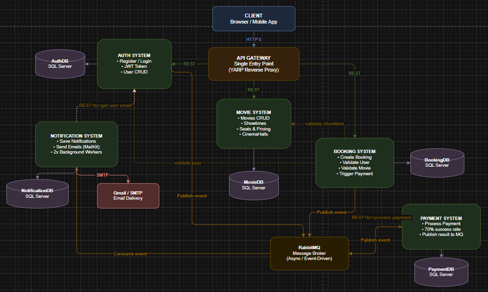

# TicketUZ - Cinema Ticket Booking System

A distributed microservices-based cinema ticket booking platform built with .NET 8.0, demonstrating modern cloud-native architecture patterns including event-driven communication, JWT authentication, and database-per-service design.

## 🎯 Overview

TicketUZ is a production-ready cinema booking system that showcases microservices architecture best practices. The system allows users to browse movies, select showtimes, book seats, process payments, and receive notifications - all through a secure API Gateway with JWT authentication and role-based access control.

## 🏗️ Architecture

### Microservices
1. **API Gateway** (Port 7000) - Entry point for client requests with JWT validation and intelligent routing
2. **Auth System** (Port 5001) - User management, JWT tokens, Google OAuth 2.0 integration
3. **Movie System** (Port 5002) - Movies, showtimes, cinema halls, seat management
4. **Booking System** (Port 5003) - Reservation handling, seat booking orchestration
5. **Payment System** (Port 5004) - Payment processing and transaction management
6. **Notification System** (Port 5005) - Email/SMS notifications via event-driven messaging

### Technology Stack
- **Framework**: .NET 8.0 (ASP.NET Core Web API)
- **Database**: SQL Server 2022 with Entity Framework Core 9.0
- **Message Broker**: RabbitMQ 3 (event-driven communication)
- **Authentication**: JWT Bearer tokens with BCrypt password hashing
- **OAuth**: Google OAuth 2.0 integration
- **Containerization**: Docker & Docker Compose
- **API Documentation**: Swagger/OpenAPI

## 📡 Component diagram




## 🔗 Inter-Service Communication Map

### 🔵 API Gateway → Downstream Services

| Calls         | Endpoint						 |
|---------------|--------------------------------|
| AuthSystem    | `POST api/auth/login`          |
| AuthSystem    | `POST api/auth/register`       |
| AuthSystem    | `PUT api/users/{userId}/role`  |
| MovieSystem   | `GET api/movies`               |
| MovieSystem   | `POST api/movies`              |
| MovieSystem   | `GET api/showtimes`            |
| MovieSystem   | `POST api/showtimes`			 |
| MovieSystem   | `GET api/cinemahalls`          |
| MovieSystem   | `POST api/cinemahalls`         |
| BookingSystem | `POST api/bookings`            |
| BookingSystem | `GET api/bookings`             |

---

### 🟢 Booking System → Downstream Services

| Calls         | Endpoint                                         | Why												|
|---------------|--------------------------------------------------|----------------------------------------------------|
| AuthSystem    | `GET api/users/exists/{userId}`                  | Validate user exists								|
| MovieSystem   | `GET api/showtimes/{id}/seats/{seatId}/validate` | Validate seat is available							|
| PaymentSystem | `POST api/payments`                              | Process payment									|
| RabbitMQ      | queue: `notification.exchanges`                  | Publish 3 events: Pending / Confirmed / Cancelled  |

---

### 🟢 Payment System → Downstream Services

| Calls         | Endpoint / Queue                           | Why                                      |
|---------------|--------------------------------------------|------------------------------------------|
| RabbitMQ      | queue: `notification.exchanges`            | Publish payment success/fail event       |
| PaymentDB     | SQL Server                                 | Stores payment record                    |

---

### 🟢 Notification System → Downstream Services

| Calls			 | Endpoint							 | Why								|
|----------------|-----------------------------------|----------------------------------|
| AuthSystem     | `GET api/users/email/{userId}`    | Get user's email to send to      |
| RabbitMQ       | queue: `notification.exchanges`   | Listens (consumes) all events    |
| Gmail SMTP     | `smtp.gmail.com:587`              | Sends real emails                |
| NotificationDB | SQL Server                        | Stores all notifications         |

---

### 🟢 Auth System
> Only **receives** calls, never calls other services.

Exposes:
- `POST api/auth/register`
- `POST api/auth/login`
- `POST api/auth/google/login`
- `POST api/auth/google/register`
- `GET api/users/exists/{userId}`
- `GET api/users/email/{userId}`
- `PUT api/users/{userId}/role`

---

### 🟢 Movie System
> Only **receives** calls, never calls other services.

Exposes:
- `GET / POST api/movies`
- `GET / POST api/showtimes`
- `GET api/showtimes/{id}/seats/{seatId}/validate`
- `GET / POST api/cinemahalls`

---

> 💡 **Key insight:** `BookingSystem` is the orchestrator — it coordinates Auth, Movie, Payment, and RabbitMQ all within a single booking flow.


## 📡 API Endpoints

### API Gateway (Client-Facing)
```
POST   /api/auth/register          - User registration
POST   /api/auth/login            - User login
POST   /api/auth/google-login     - Google OAuth login
GET    /api/movies                - List all movies
GET    /api/showtimes             - Get showtimes
POST   /api/bookings              - Create booking
GET    /api/bookings/{id}         - Get booking details
POST   /api/payments              - Process payment
```

### Auth System
```
POST   /api/auth/register         - Register new user
POST   /api/auth/login            - Login with credentials
POST   /api/auth/google-login     - Google OAuth authentication
GET    /api/users                 - Get all users (Admin)
GET    /api/users/{id}            - Get user by ID
PUT    /api/users/{id}            - Update user
DELETE /api/users/{id}            - Delete user (Admin)
```

### Movie System
```
GET    /api/movies                - List all movies
POST   /api/movies                - Create movie (Admin)
PUT    /api/movies/{id}           - Update movie (Admin)
DELETE /api/movies/{id}           - Delete movie (Admin)
GET    /api/cinemahalls           - List cinema halls
POST   /api/showtimes             - Create showtime (Admin)
```

### Booking System
```
GET    /api/bookings              - Get all bookings
GET    /api/bookings/{id}         - Get booking by ID
POST   /api/bookings              - Create new booking
PUT    /api/bookings/{id}         - Update booking status
```

### Payment System
```
GET    /api/payments              - Get all payments
GET    /api/payments/{id}         - Get payment by ID
POST   /api/payments              - Process payment
```

### Notification System
```
GET    /api/notifications         - Get user notifications
```

