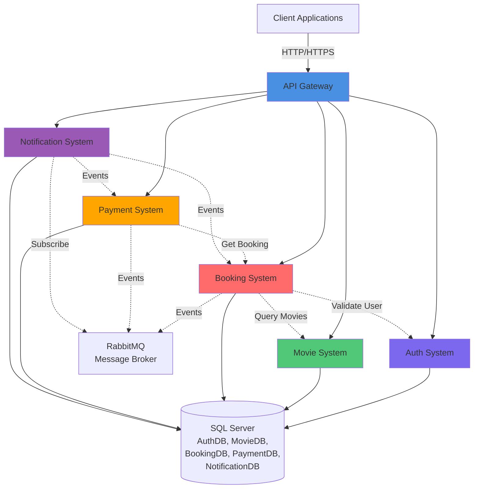
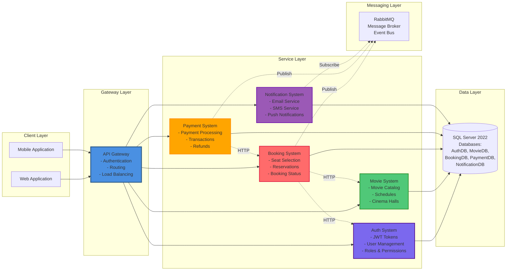
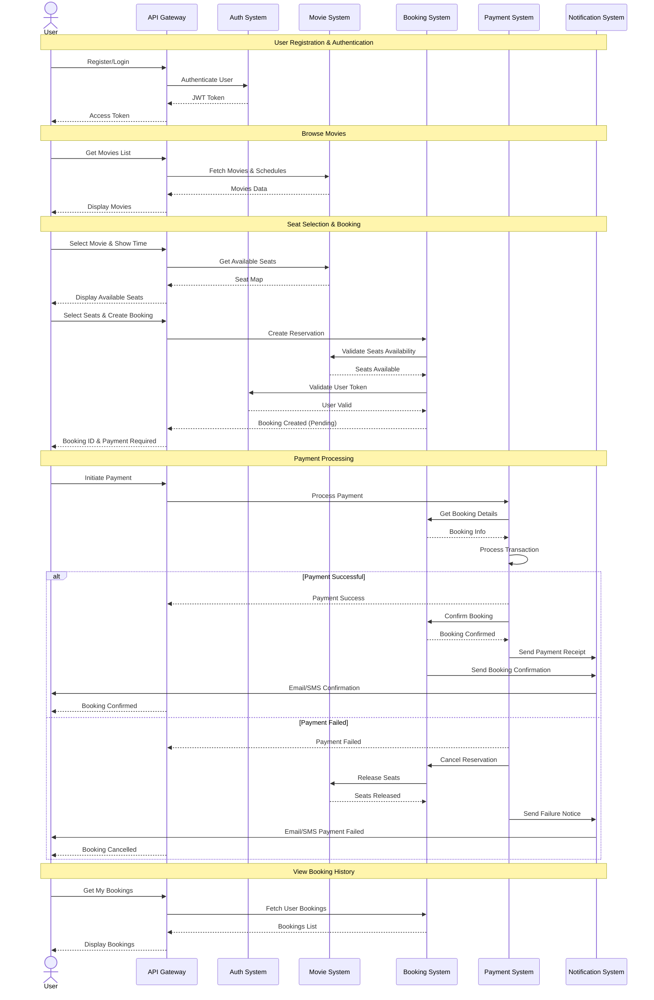

# TicketUZ - Microservices Cinema Ticket Booking System

A distributed microservices-based cinema ticket booking platform built with .NET 8.0, featuring event-driven architecture, JWT authentication, and role-based access control.

## 🏗️ Architecture Overview

TicketUZ follows a microservices architecture pattern with an API Gateway, event-driven communication via RabbitMQ, and independent service databases. Each service handles a specific domain of the business logic.

### Services

1. **API Gateway** (Port 7000) - Entry point for all client requests with JWT authentication and role-based routing
2. **Auth System** (Port 5001) - User authentication, authorization, and Google OAuth integration
3. **Movie System** (Port 5002) - Movie catalog, showtimes, cinema halls, and seat management
4. **Booking System** (Port 5003) - Seat reservation and booking lifecycle management
5. **Payment System** (Port 5004) - Payment processing and transaction status tracking
6. **Notification System** (Port 5005) - Asynchronous notification handling via RabbitMQ events

### Key Features

✅ **JWT Authentication** - Secure token-based authentication with 24-hour lifetime  
✅ **Role-Based Access Control** - Admin and User roles with endpoint-level authorization  
✅ **Google OAuth Integration** - Social login support for user registration and authentication  
✅ **Event-Driven Architecture** - RabbitMQ message broker for async communication  
✅ **Database Per Service** - Each microservice maintains its own SQL Server database  
✅ **Docker Compose** - Full containerized deployment with single command startup

## 📊 System Architecture Diagram



## 🔗 Component Dependencies



## 🔄 Business Process Flow



## 🚀 Getting Started

### Prerequisites

- [.NET 8.0 SDK](https://dotnet.microsoft.com/download)
- [Docker](https://www.docker.com/get-started) & Docker Compose
- [SQL Server 2022](https://www.microsoft.com/sql-server) (or use Docker container)
- [RabbitMQ](https://www.rabbitmq.com/) (or use Docker container)

### Running with Docker Compose

1. Clone the repository:
```bash
git clone https://github.com/yourusername/TicketUZ.git
cd TicketUZ
```

2. Start all services:
```bash
docker-compose up -d
```

3. Services will be available at:
- API Gateway: `http://localhost:7000`
- Auth System: `http://localhost:5001`
- Movie System: `http://localhost:5002`
- Booking System: `http://localhost:5003`
- Payment System: `http://localhost:5004`
- Notification System: `http://localhost:5005`
- SQL Server: `localhost:1433` (sa / YourStrong!Passw0rd)
- RabbitMQ Management: `http://localhost:15672` (guest / guest)

### Running Individual Services

Each service can be run independently:

```bash
cd AuthSystem/src/AuthSystem.Api
dotnet run
```

Repeat for other services as needed.

## 🛠️ Technology Stack

### Backend
- **Framework**: .NET 8.0
- **Language**: C# 12
- **API Style**: RESTful APIs
- **Architecture**: Microservices

### Data & Messaging
- **Database**: SQL Server 2022
- **Message Broker**: RabbitMQ 3
- **ORM**: Entity Framework Core

### Security & Authentication
- **Authentication**: JWT Bearer Tokens
- **OAuth Provider**: Google OAuth 2.0
- **Password Hashing**: PBKDF2 with Salt

### DevOps & Deployment
- **Containerization**: Docker & Docker Compose
- **API Documentation**: Swagger/OpenAPI 3.0

### Communication Patterns
- **Synchronous**: HTTP/REST for request-response
- **Asynchronous**: RabbitMQ for event-driven communication

## 🎬 Complete Booking Flow Example

### Scenario: User Books a Movie Ticket

1. **User Registration**
   ```
   POST /api/gateway/authsystem/auth/register
   → Returns: UserId
   ```

2. **User Login**
   ```
   POST /api/gateway/authsystem/auth/login
   → Returns: JWT Token (valid 24 hours)
   ```

3. **Browse Available Movies**
   ```
   GET /api/gateway/moviesystem/showtimes
   → Returns: List of movies with showtimes
   ```

4. **Check Seat Availability** (Internal)
   ```
   GET /api/showtimes/{showtimeId}?includeSeats=true
   → Returns: Showtime with seat map
   ```

5. **Create Booking**
   ```
   POST /api/gateway/bookingsystem/bookings
   Headers: Authorization: Bearer {token}
   Body: { userId, showtimeId, seatId }
   → Returns: BookingId (Status: Pending)
   
   Internal Flow:
   - Validate user exists (AuthSystem)
   - Validate showtime/seat (MovieSystem)
   - Create booking record
   - Publish BookingCreated event to RabbitMQ
   ```

6. **Process Payment**
   ```
   POST /api/payments
   Body: { userId, bookingId, amount }
   → Returns: PaymentId with status
   
   Internal Flow:
   - Get booking details
   - Process payment transaction
   - If successful:
     * Update payment status to Success
     * Update booking status to Confirmed
     * Publish PaymentSuccess event to RabbitMQ
   - If failed:
     * Update payment status to Failed
     * Update booking status to Cancelled
     * Publish PaymentFailed event to RabbitMQ
   ```

7. **Receive Notification** (Async)
   ```
   NotificationSystem listens to RabbitMQ:
   - On PaymentSuccess: Send confirmation email/SMS
   - On PaymentFailed: Send failure notification
   ```

### Admin Operations

**Add New Movie**
```
POST /api/gateway/moviesystem/movies
Headers: Authorization: Bearer {admin_token}
Body: { title, description, duration, genre, releaseDate }
```

**Create Showtime**
```
POST /api/gateway/moviesystem/showtimes
Headers: Authorization: Bearer {admin_token}
Body: { movieId, cinemaHallId, startTime, price }
```

**View All Bookings**
```
GET /api/gateway/bookingsystem/bookings
Headers: Authorization: Bearer {admin_token}
```

## 📁 Project Structure

```
TicketUZ/
├── APIGateway/          # API Gateway Service
├── AuthSystem/          # Authentication & Authorization
├── MovieSystem/         # Movie Catalog Management
├── BookingSystem/       # Booking & Reservation Logic
├── PaymentSystem/       # Payment Processing
├── NotificationSystem/  # Notification Service
└── docker-compose.yml   # Docker orchestration
```

Each service follows a clean architecture pattern:
```
ServiceName/
├── ServiceName.sln
└── src/
    └── ServiceName.Api/
        ├── Controllers/      # API endpoints
        ├── Services/         # Business logic
        ├── Entities/         # Domain models
        ├── Dtos/            # Data transfer objects
        ├── Persistense/     # Database context & repositories
        ├── Configurations/  # Service configuration
        └── Program.cs       # Application entry point
```

## 🔒 Authentication & Authorization

The system uses **JWT (JSON Web Tokens)** for secure authentication:

### JWT Configuration
- **Issuer**: `http://Ticket.uz`
- **Audience**: `movie-booking-client`
- **Token Lifetime**: 24 hours
- **Algorithm**: HMAC-SHA256

### Authentication Flow
1. **Register/Login** → Receive JWT access token
2. **Include token** in Authorization header: `Bearer <token>`
3. **API Gateway** validates token and checks user roles
4. Request is **routed to appropriate microservice**

### User Roles
- **Admin**: Full access to all endpoints including movie/showtime management
- **User**: Access to booking creation and viewing own bookings
- **Public**: Access to view movies and showtimes without authentication

### Google OAuth Support
- `POST /api/auth/google/register` - Register with Google account
- `POST /api/auth/google/login` - Login with Google account

### Protected Endpoints
```
Admin Only:
- All movie management operations (create/delete)
- All showtime management operations
- All cinema hall management operations
- View all bookings

User/Admin:
- Create bookings
- View own bookings
- Process payments

Public:
- View movies and showtimes
- User registration and login
```

## 📡 API Endpoints

### API Gateway (Port 7000) - Client Entry Point

#### Authentication Endpoints
- `POST /api/gateway/authsystem/auth/register` - User registration
- `POST /api/gateway/authsystem/auth/login` - User login
- `PUT /api/gateway/authsystem/{userId}/role` - Set user role (Admin only)

#### Movie Management Endpoints (Admin Only)
- `POST /api/gateway/moviesystem/cinemahalls` - Create cinema hall
- `GET /api/gateway/moviesystem/cinemahalls` - Get all cinema halls
- `POST /api/gateway/moviesystem/movies` - Add new movie
- `GET /api/gateway/moviesystem/movies` - Get all movies
- `POST /api/gateway/moviesystem/showtimes` - Create showtime

#### Public Movie Endpoints
- `GET /api/gateway/moviesystem/showtimes` - Get all showtimes (Public)

#### Booking Endpoints
- `POST /api/gateway/bookingsystem/bookings` - Create booking (User/Admin)
- `GET /api/gateway/bookingsystem/bookings` - Get all bookings (Admin only)

---

### Auth System (Port 5001) - Direct Access

#### Authentication
- `POST /api/auth/register` - Standard email/password registration
- `POST /api/auth/login` - Standard email/password login
- `POST /api/auth/google/register` - Register via Google OAuth
- `POST /api/auth/google/login` - Login via Google OAuth

#### User Management
- `PUT /api/users/{userId}/role` - Update user role
- `GET /api/users/exists/{userId}` - Check if user exists
- `GET /api/users/email/{userId}` - Get user email
- `GET /api/users` - Get all users

---

### Movie System (Port 5002) - Direct Access

#### Movies
- `POST /api/movies` - Add new movie
- `GET /api/movies` - Get all movies
- `DELETE /api/movies?movieId={id}` - Delete movie

#### Showtimes
- `POST /api/showtimes` - Create showtime
- `GET /api/showtimes` - Get all showtimes
- `GET /api/showtimes/{id}?includeSeats={bool}` - Get showtime details
- `GET /api/showtimes/{showtimeId}/seats/{seatId}/validate` - Validate seat availability

#### Cinema Halls
- `GET /api/cinemahalls` - Get all cinema halls
- `POST /api/cinemahalls` - Create cinema hall

---

### Booking System (Port 5003) - Direct Access

- `POST /api/bookings` - Create new booking
- `GET /api/bookings/{id}` - Get booking by ID
- `GET /api/bookings` - Get all bookings
- `DELETE /api/bookings/{id}` - Cancel booking

---

### Payment System (Port 5004) - Direct Access

- `POST /api/payments` - Process payment
- `GET /api/payments/{id}` - Get payment by ID
- `GET /api/payments` - Get all payments

---

### Notification System (Port 5005) - Direct Access

- `GET /api/notification` - Get all notifications

> **Note**: The API Gateway is the recommended entry point for client applications. Direct service access is available but should be used with caution in production environments.

## 💾 Database Schema

Each microservice maintains its own database in SQL Server 2022.

### Auth Database (AuthDb)
**User Table**
- UserId (PK, long)
- UserName, FirstName, LastName
- Email, EmailConfirmed
- PasswordHash, Salt
- GoogleId, GoogleProfilePicture (for OAuth)
- Role (Admin/User)
- CreatedAt

### Movie Database (MovieDb)
**Movie Table**
- MovieId (PK, long)
- Title, Description
- DurationMinutes
- Language, Genre
- ReleaseDate, Rating
- CreatedAt, UpdatedAt

**Showtime Table**
- ShowtimeId (PK, long)
- StartTime, EndTime
- MinPrice, MaxPrice
- MaxRow, MaxColumn (seat layout)
- MovieId (FK), CinemaHallId (FK)

**CinemaHall Table**
- CinemaHallId (PK, long)
- Name, Capacity
- Configuration details

**Seat Table**
- SeatId (PK, long)
- RowNumber, ColumnNumber
- Price, IsAvailable
- ShowtimeId (FK)

### Booking Database (BookingDb)
**Booking Table**
- BookingId (PK, long)
- UserId, ShowtimeId, SeatId
- TotalPrice
- BookingDate
- Status (Pending/Confirmed/Cancelled)

### Payment Database (PaymentDb)
**Payment Table**
- PaymentId (PK, long)
- UserId, BookingId
- Amount
- Status (Pending/Success/Failed)
- CreatedAt

### Notification Database (NotificationDb)
**Notification Table**
- NotificationId (PK, long)
- UserId
- Message, Type
- SentAt, Status

## 🧪 Development

### Build Solution
```bash
# Build all services
dotnet build

# Build specific service
cd AuthSystem
dotnet build
```

### Run Tests
```bash
dotnet test
```

### Database Migrations
Each service manages its own database in SQL Server:
```bash
cd AuthSystem/src/AuthSystem.Api
dotnet ef migrations add InitialCreate
dotnet ef database update
```

### Connection Strings
All services use SQL Server with the following pattern:
```
Server=sqlserver;Database=<ServiceDB>;User Id=sa;Password=YourStrong!Passw0rd;TrustServerCertificate=True;
```

**Databases**:
- AuthDb - Authentication service
- MovieDb - Movie service
- BookingDb - Booking service
- PaymentDb - Payment service
- NotificationDb - Notification service

### Service Dependencies
```
BookingSystem → AuthSystem (validate user)
BookingSystem → MovieSystem (validate showtime/seat)
PaymentSystem → BookingSystem (get booking details)
NotificationSystem → RabbitMQ (consume events)
```

## 🐳 Docker Support

The project includes complete Docker support with multi-container orchestration.

### Docker Compose Services
- **sqlserver** - SQL Server 2022 (Port 1433)
- **rabbitmq** - RabbitMQ with Management UI (Ports 5672, 15672)
- **authsystem** - Auth microservice (Port 5001)
- **moviesystem** - Movie microservice (Port 5002)
- **bookingsystem** - Booking microservice (Port 5003)
- **paymentsystem** - Payment microservice (Port 5004)
- **notificationsystem** - Notification microservice (Port 5005)
- **apigateway** - API Gateway (Port 7000)

### Docker Commands
```bash
# Build all images
docker-compose build

# Start all services
docker-compose up -d

# Stop all services
docker-compose down

# View logs for all services
docker-compose logs -f

# View logs for specific service
docker-compose logs -f authsystem

# Restart a service
docker-compose restart authsystem

# Remove volumes (clean database)
docker-compose down -v
```

### Environment Variables
Services are pre-configured with environment variables in docker-compose.yml:
- Database connection strings
- RabbitMQ host configuration
- Service URLs for inter-service communication
- JWT settings

## 📈 Monitoring & Health Checks

### Service Access Points
- **API Gateway**: http://localhost:7000
- **Auth System**: http://localhost:5001
- **Movie System**: http://localhost:5002
- **Booking System**: http://localhost:5003
- **Payment System**: http://localhost:5004
- **Notification System**: http://localhost:5005

### Infrastructure Access
- **SQL Server**: localhost:1433
  - Username: `sa`
  - Password: `YourStrong!Passw0rd`
  - Connection: `Server=localhost,1433;Database=AuthDb;User Id=sa;Password=YourStrong!Passw0rd;TrustServerCertificate=True;`

- **RabbitMQ Management UI**: http://localhost:15672
  - Username: `guest`
  - Password: `guest`
  - AMQP Port: 5672

### Swagger Documentation
Each service exposes Swagger UI for API testing:
- Auth System: http://localhost:5001/swagger
- Movie System: http://localhost:5002/swagger
- Booking System: http://localhost:5003/swagger
- Payment System: http://localhost:5004/swagger
- Notification System: http://localhost:5005/swagger
- API Gateway: http://localhost:7000/swagger

## 📊 Project Statistics

### Microservices
- **Total Services**: 6 microservices + 1 API Gateway
- **Total Endpoints**: 40+ REST endpoints
- **Databases**: 5 independent SQL Server databases
- **Message Queues**: RabbitMQ for async communication

### API Endpoints Breakdown
- **API Gateway**: 11 client-facing endpoints
- **Auth System**: 8 endpoints (4 auth + 4 user management)
- **Movie System**: 9 endpoints (movies, showtimes, cinema halls, seats)
- **Booking System**: 4 endpoints (CRUD operations)
- **Payment System**: 3 endpoints (process, get by ID, get all)
- **Notification System**: 1 endpoint (get notifications)

### Entity Models
- User (Auth)
- Movie, Showtime, CinemaHall, Seat (Movie)
- Booking (Booking)
- Payment (Payment)
- Notification (Notification)

### Authentication Features
- JWT token-based authentication
- Google OAuth 2.0 integration
- Role-based authorization (Admin/User)
- 24-hour token lifetime

## 🤝 Contributing

1. Fork the repository
2. Create your feature branch (`git checkout -b feature/AmazingFeature`)
3. Commit your changes (`git commit -m 'Add some AmazingFeature'`)
4. Push to the branch (`git push origin feature/AmazingFeature`)
5. Open a Pull Request

## 📝 License

This project is licensed under the MIT License - see the LICENSE file for details.

## 👥 Team

TicketUZ Development Team - [PDP Academy](https://pdp.uz)

## 📞 Support

For support and questions, please open an issue in the GitHub repository.

---

Made with ❤️ by PDP Academy
